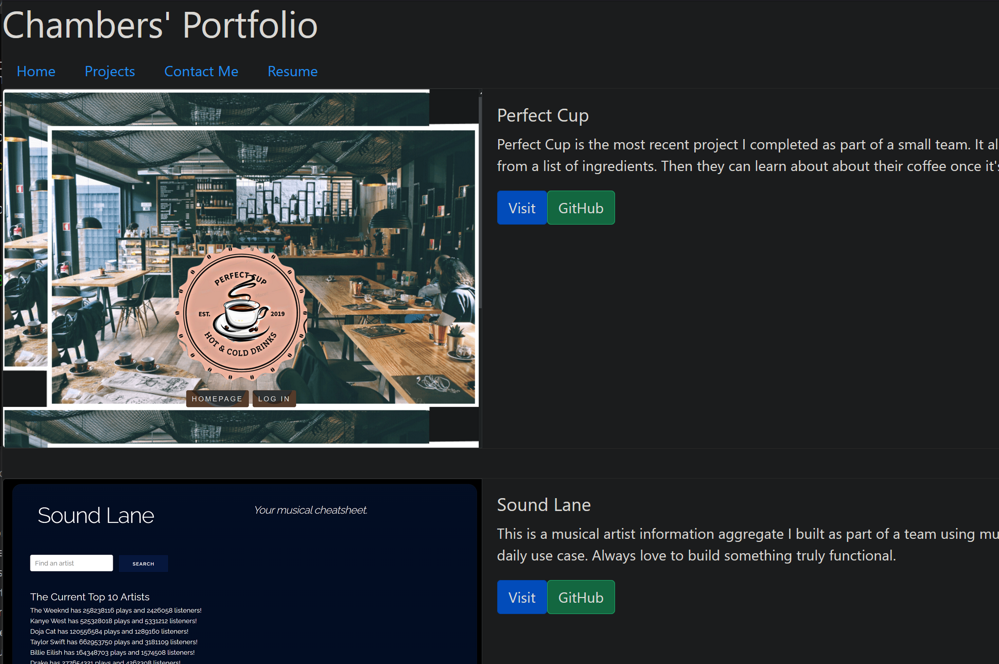
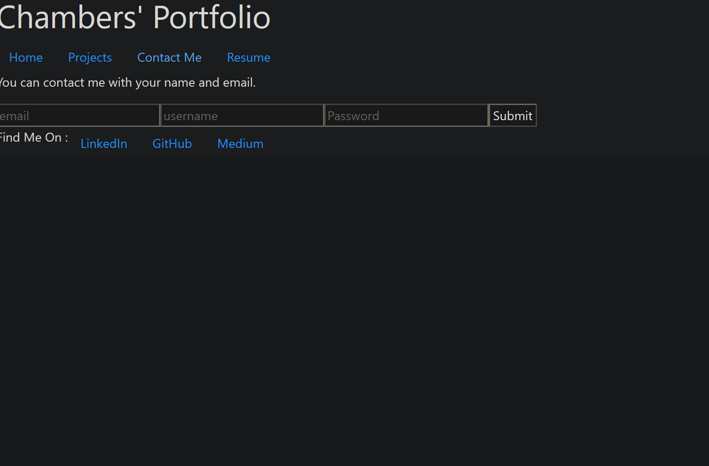
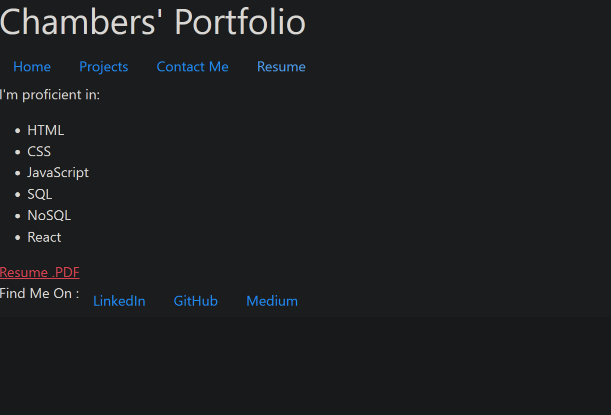

# Portfolio in React
This is my fourth take on a professional portfolio, the site has a handful of the projects I've worked on that I'm proud of along with links to my linkedIn page, GitHub and Resume pdf. More than that the site is built using React, a JavaScript library I've been learning and this seemed the best way to showcase what I've honed.

The styling was thanks to Bootstrap a popular CSS framework I'm fond of.

I prefer a minimalist design that gets straight to the point though I may reconsider in the future as I'm still fond of my original portfolio's design. As of now, the color serves only to differentiate the elements on the page albeit tastefully.

Link: https://mchambersiv.github.io/portfolio-v4-react/

## ScreenShots
This is the page on load.

This the Projects Page

This is the Contact Me Page

Lastly, this is the Resume Page.

